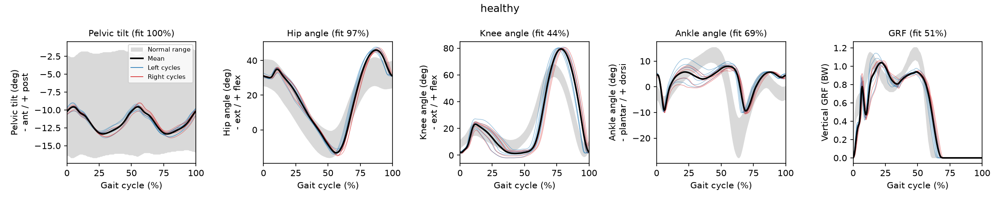

# Predictive Simulation of Healthy and Pathological Gait with SCONE

My solution to the SCONE assignment of **[BIOENG-404 Analysis and Modelling of Locomotion](https://graphsearch.epfl.ch/en/course/BIOENG-404)** at [EPFL](https://www.epfl.ch): a reflex-controlled musculoskeletal model is optimized to walk, then weakened, made spastic and given a self-chosen impairment to see which pathological gaits emerge. The simulations run headless, and the gait analysis is a small, tested Python package.

## The course

**[BIOENG-404 Analysis and Modelling of Locomotion](https://graphsearch.epfl.ch/en/course/BIOENG-404)** is a 4 ECTS master's course at [EPFL](https://www.epfl.ch) (Ecole polytechnique fédérale de Lausanne), offered in the bioengineering programme and taken as an option in the robotics and neuroscience programmes. It is taught jointly by three labs:

- **[Prof. Kamiar Aminian](https://people.epfl.ch/kamiar.aminian)** (now emeritus), former head of the [Laboratory of Movement Analysis and Measurement (LMAM)](https://lmam.epfl.ch), which closed in 2023: gait measurement with force plates, pressure insoles and wearable inertial sensors;
- **[Prof. Auke Ijspeert](https://people.epfl.ch/auke.ijspeert)**, [Biorobotics Laboratory (BioRob)](https://biorob.epfl.ch): numerical models of locomotion, reflex and central pattern generator controllers, links to legged robots;
- **[Prof. Grégoire Courtine](https://people.epfl.ch/gregoire.courtine)**, [Courtine Lab](https://courtine-lab.epfl.ch), neuroprosthetics for spinal cord injury: motor circuits, epidural electrical stimulation and recovery of walking.

The course description reads: "an overview of the state of the art in the analysis and modeling of human locomotion and the underlying motor circuits", covering neurophysiology, gait characterization, biomechanics, numerical modeling, neuroprosthetics and biped robots.

The lectures are paired with a series of hands-on assignments. Based on the 2021 edition, the series looks like this:

| Assignment | Topic |
|---|---|
| Gait analysis | Gait parameters from measured kinematics and kinetics, healthy subjects versus spinal cord injury |
| OpenSim | Inverse kinematics and inverse dynamics with a musculoskeletal model |
| **SCONE** | **Forward, predictive simulation of healthy and pathological gait (this repository)** |
| Neural and EMG data | Feature extraction and PCA of motion capture and EMG in rats, monkeys and humans with spinal cord injury |

The SCONE assignment was written by Alice Bruel, Dimitar Stanev, Andrea Di Russo and [Auke Ijspeert](https://people.epfl.ch/auke.ijspeert) ([BioRob](https://biorob.epfl.ch)).

### Links

- Course page (EPFL Graph Search): <https://graphsearch.epfl.ch/en/course/BIOENG-404>
- EPFL coursebook: `edu.epfl.ch/coursebook/en/analysis-and-modelling-of-locomotion-BIOENG-404` (no longer online; the course is not in the current coursebook)
- BioRob teaching page: <https://www.epfl.ch/labs/biorob/students/>
- SCONE: <https://scone.software> and the paper by Geijtenbeek (2019), [JOSS 4(38) 1421](https://doi.org/10.21105/joss.01421)
- The reflex controller: Geyer and Herr (2010), [IEEE TNSRE 18(3) 263](https://doi.org/10.1109/TNSRE.2010.2047592)
- Research from the same group on toe and heel walking in SCONE: Bruel et al. (2022), [J Physiol 600(11) 2691](https://doi.org/10.1113/JP282609)

## The assignment

The handout, [`docs/handout/SCONE-assignment-2021.pdf`](docs/handout/SCONE-assignment-2021.pdf) (spring 2021, two weeks), is the specification for this repository.

**Model and controller.** A planar version of the OpenSim gait2392 model (9 degrees of freedom, 14 muscles, foot-ground contact) is driven by the Geyer and Herr (2010) reflex controller, extended with soleus and gastrocnemius velocity reflexes. Each reflex has the form

```
u_m(t) = c0 + kl (l_m(t - dt) - l0) + kv v_m(t - dt) + kf f_m(t - dt)
```

and is active in specific gait phases. SCONE runs a 10 s forward simulation, scores it with a weighted sum of measures (reach a minimum speed without falling, metabolic cost of transport, joint limits, head stability), and adjusts the 40 controller and initial-state parameters with CMA-ES until the score is low.

**Deliverables.**

1. **Healthy gait.** Optimize `HealthyGait.scone` until the gait is good (fewer than 50 generations, objective below 0.9). Comment on the objective terms and on the gait analysis (joint angles and ground reaction forces against normal data). What could be improved?
2. **Heel walking from plantarflexor weakness.** Copy the scenario to `Weakness.scone` with a new `Measure05.scone` (minimum speed 0.5 m/s). Scale the maximum isometric force of soleus and gastrocnemius on both legs, and find a factor that produces heel walking (at most 200 generations). What are the main kinematic adaptations?
3. **Toe walking from hyperreflexia.** Copy the scenario to `Hyperreflexia.scone` and the controller to `ControllerHyperreflexia.scone`. Raise the stance-phase velocity reflex gain KV of soleus and gastrocnemius (same value for both, default 0.1), and find a gain that produces toe walking (at most 200 generations). What are the main kinematic adaptations?
4. **Own model.** Propose a biomechanical or neural change that should cause heel or toe walking, explain why, simulate it in `Model.scone` (and `ControllerModel.scone` if the controller changes), and discuss the result. If it fails, propose compensations that could explain why.

**Rules for the submission.** Every question is stated and answered concisely in the report, and every plot is labelled with units. The archive `SCONE_Name_Surname.zip` holds the report as PDF, all SCONE setup files, and the optimization result folders with intermediate solutions removed but with the best solution for each question, so the simulations can be reproduced without re-optimizing.

The handout gives no grading rubric. The deliverable list and submission rules above are treated as the checklist.

**Extension: crouch gait.** Crouch gait (excessive knee and hip flexion in stance, common in cerebral palsy) is not part of the 2021 handout. It is added at the end as a separate, clearly labelled study using the same method.

## How it works here

The handout expects the SCONE desktop app on Windows. This repository runs the official Linux build of SCONE headless in Docker instead, through the command line tool `sconecmd`, so every optimization can be repeated from a terminal. The gait analysis that SCONE Studio shows in a window (joint angles and ground reaction forces against normative bands) is reimplemented in Python with tests, so the figures in the report come from code.

### Repository layout

| Path | Content |
|---|---|
| [`docs/handout/`](docs/handout) | The 2021 assignment handout (the specification) |
| [`docs/report/`](docs/report) | The report (Markdown source and PDF) |
| [`docs/notebook.md`](docs/notebook.md) | Lab notebook: every run, decision and mistake, in order |
| [`docs/compute.md`](docs/compute.md) | Machine spec, SCONE speed benchmarks, and the cost of every optimization |
| [`scone/`](scone/README.md) | Course setup files and the deliverable scenarios (`Weakness.scone`, `Hyperreflexia.scone`, `Model.scone`, ...) |
| [`scone/sweeps/`](scone/sweeps) | Every scenario variant that was optimized |
| `results/<name>/` | Curated runs: setup files SCONE copied, best solution, its evaluation (`.par.sto`) and objective breakdown (`.par.txt`) |
| [`results/figures/`](results/figures) | Gait analysis figures and metric summaries |
| [`src/scone_gait/`](src/scone_gait) | Python package: storage and result readers, gait cycles, normative comparison, clinical metrics, plots, command line tool |
| [`tests/`](tests) | Unit tests, plus regression tests on a real simulation |
| [`scripts/`](scripts) | Docker runner, batch launcher, run finalization, figures, report and submission builders |

### Reproducing

```bash
# Python tools and tests
uv venv --python 3.12 .venv && source .venv/bin/activate
uv pip install -e ".[dev]" && pytest

# SCONE in Docker (needs the GitHub CLI to download the CI build)
scripts/fetch_scone.sh
docker build -t scone-headless:latest -f docker/Dockerfile .

# Optimize, then evaluate, curate and analyze the best solution
scripts/scone.sh optimize scone/HealthyGait.scone CmaOptimizer.max_generations=50
scripts/finalize_run.sh results/runs/<run id> healthy

# Replay a curated solution without optimizing
scripts/scone.sh evaluate results/healthy/0035_1.021_0.780.par

# Figures, report and submission archive
scripts/make_figures.sh && scripts/build_report.sh && scripts/package_submission.sh
```

On Apple silicon the amd64 image runs under emulation. On an idle Apple M5 one 10 s simulation takes about 5 to 6 s, and a generation of 15 walking candidates about 20 s. The whole campaign (15 optimizations, about 1,900 generations and 28,000 simulations) took about 12.5 hours of wall time with several runs in parallel. Hardware, benchmarks and a per-run log are in [`docs/compute.md`](docs/compute.md).

## Results

| Deliverable | Impairment | Result |
|---|---|---|
| 1. Healthy gait | none | walks at 1.0 m/s, objective 0.780 after 35 generations (target below 0.9) |
| 2. Weakness | plantarflexor force x 0.5 | **heel walking**: dorsiflexed contact, excessive stance dorsiflexion, no push-off, knee hyperextension |
| 3. Hyperreflexia | stance velocity reflex gain of soleus and gastrocnemius fixed at 1.0 | **toe walking**: forefoot contact, heel never down |
| 4. Own model | plantarflexor tendon 10 % shorter (contracture) | **toe walking**, with slow ankle dorsiflexion in early stance that tells it apart from spasticity |
| Extension | hamstring and iliopsoas contracture | no crouch: the model tilts the pelvis posteriorly instead |



Two findings beyond the questions:

- **The handout's hyperreflexia recipe lets the optimizer reshape the impairment.** Written as `KV = ~1.0<0,10>`, the reflex gain stays a design parameter: the optimizer halved the soleus gain and raised the gastrocnemius gain to 1.56. The chosen solution fixes the gain instead, as SCONE's own tutorial does.
- **Weakness is the hardest condition to optimize.** At half strength the model needed 176 of the 200 allowed generations to find a gait that does not fall, and at a quarter strength it never did.

The report is [`docs/report/report.pdf`](docs/report/report.pdf) (source: [`report.md`](docs/report/report.md)), and every run, including failed ones and mistakes, is in the [lab notebook](docs/notebook.md).
