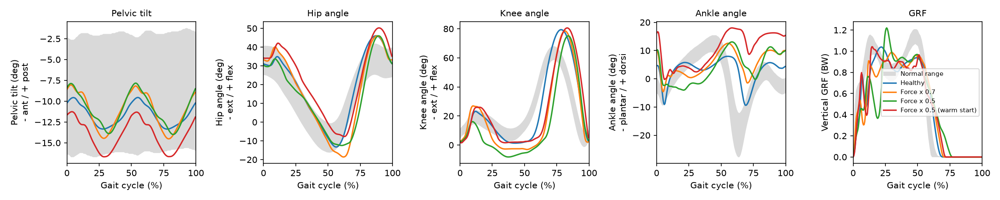
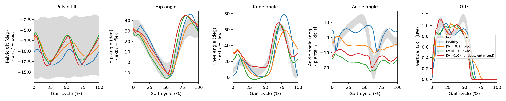
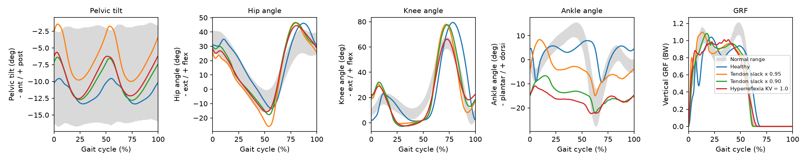
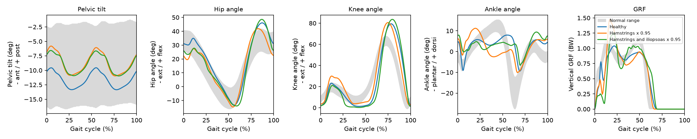
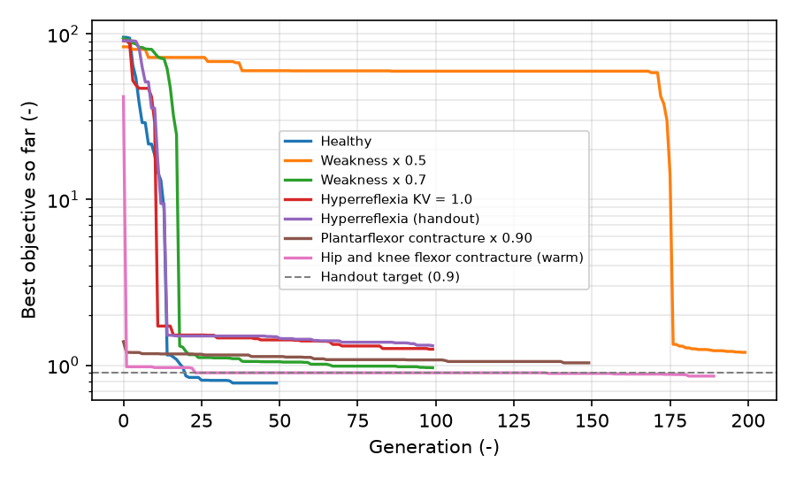

# Setup

**Model.** `Human0914.osim` is a planar OpenSim 3 model with 9 degrees of
freedom (pelvis tilt, horizontal and vertical pelvis translation, hip, knee
and ankle on both legs) and 14 Hill-type muscles (hamstrings, gluteus maximus,
iliopsoas, vasti, gastrocnemius, soleus and tibialis anterior on each side).
Contact spheres at the heel and toes produce the ground reaction forces.

**Controller.** `ControllerComplexGH.scone` is the Geyer and Herr (2010)
reflex controller with extra velocity (V+) reflexes on soleus and
gastrocnemius. A state machine detects five gait phases per leg (early stance,
late stance, liftoff, swing, landing), and in each phase a set of reflexes of
the form
$u_m(t) = c_0 + k_l\,(l_m(t-\Delta t) - l_0) + k_v\,v_m(t-\Delta t) + k_f\,f_m(t-\Delta t)$
sets the muscle excitations. The 40 design parameters are reflex gains and
offsets plus initial joint angle offsets.

**Objective.** `MeasureGait.scone` adds up five measures:

| Measure | Weight | Penalizes |
|---|---|---|
| Gait | 100 | steps slower than `min_velocity`, and falling: the simulation stops when the centre of mass drops below 85 % of its initial height and the remaining time counts as standing still. Values below 0.05 count as 0 |
| Effort | 0.1 | metabolic cost of transport (Wang et al. 2012), in J/(kg m) |
| DofLimits | 0.1, 0.01 | ankle outside [-60, 60] deg; knee limit torque above 5 Nm |
| HeadStabilityY | 0.25 | vertical head acceleration beyond 0.5 g |
| HeadStabilityX | 0.25 | horizontal head acceleration beyond 0.25 g |

The gait term is roughly the fraction of the target speed that is missed,
averaged over the steps, so a model that walks the full 10 s at or above the
minimum speed scores 0 there. With the default
weights, a good healthy gait is dominated by the effort term.

**Optimization.** SCONE runs a 10 s forward simulation per candidate and
optimizes the parameters with CMA-ES (15 candidates per generation, 7
parents), starting from `InitParameters.par`.

**How the simulations were run.** The handout expects SCONE Studio on
Windows. Here the official Linux build of SCONE 2.4.5 (OpenSim 3.3 backend)
runs headless in Docker through its command line tool, so that every run can
be repeated from a terminal (`scripts/scone.sh`). The settings are identical
to the GUI. Evaluating a solution prints the objective broken down into its
measures, which is reported below for each best solution.

**Gait analysis.** SCONE Studio's Gait Analysis window was reimplemented in
Python (`src/scone_gait`), following its source code: gait cycles start at
foot contact (vertical ground reaction force above 0.001 body weight, stance
of at least 0.1 s), the first two and last cycles are dropped, every cycle is
resampled over 0 to 100 percent, and the mean curve is compared with the
normative band of SCONE Studio. The fit of one plot is
$100\,(1 - \overline{e_i / w_i})$, where $e_i$ is how far the mean lies
outside the band at the $i$-th normative sample and $w_i$ the band width; the
overall fit is the average over pelvis, hip, knee, ankle and ground reaction
force. A foot contact index locates the centre of pressure at initial contact
along the foot, from 0 at the heel to 1 at the metatarsal heads, to tell heel
strikes from forefoot strikes. Signs follow the SCONE plots: hip and knee
flexion positive, ankle dorsiflexion positive and plantarflexion negative.

# Deliverable 1: healthy gait

> *Please comment on the results obtained from the values of the objective
> functions and gait analysis tool after evaluating your solution. What can be
> improved in terms of gait properties (please elaborate)?*

**Optimization.** `HealthyGait.scone` was optimized for 50 generations. The
model first completed 10 s of walking at generation 14 (objective 1.15),
passed the 0.9 target at generation 20 (0.861), and reached its best value,
**0.780**, at generation 35. The last 15 generations brought no further
improvement, so the run had converged for this seed. The best solution is
`results/healthy/0035_1.021_0.780.par`.

| Measure | Weighted value | Raw value |
|---|---|---|
| Gait | 0 | step velocity 1.03 m/s over 17 steps (minimum 1.0) |
| Effort | 0.722 | cost of transport 7.22 J/(kg m) |
| DofLimits | 0 | knee limit torque 2.7 (left) and 2.8 Nm (right), below the 5 Nm threshold; ankle within range |
| HeadStabilityY | 0.022 | 0.088 |
| HeadStabilityX | 0.036 | 0.146 |
| **Total** | **0.780** | |

**Objective.** The model walks the whole 10 s slightly above the required
speed, so the gait term is zero, and 93 % of the objective is metabolic
effort. The cost of transport of 7.2 J/(kg m) is about twice the gross
metabolic cost measured in people walking at this speed (roughly 3 to 4
J/(kg m)), so the gait is stable but not efficient. The knee leans on its
extension limit (2.7 to 2.8 Nm of limit torque on every stance), which is
tolerated only because the joint limit measure ignores torques below 5 Nm.
Head accelerations stay small.

**Gait analysis.** Over 11 cycles the model walks at 1.01 m/s with a stride
of 1.26 m, a cadence of 96 steps/min and a stance phase of 66 % of the cycle.
The overall fit with the normal data is 72 %:

- **Pelvis and hip** are almost normal (fit 100 % and 97 %).
- **Knee** (fit 44 %): after a normal loading flexion of about 22 deg, the
  knee goes straight (0.7 deg at its least flexed) for the rest of stance,
  where people keep 5 to 10 deg of flexion. In swing it flexes to 80 deg
  instead of about 63 deg.
- **Ankle** (fit 69 %): the ankle plantarflexes quickly just after heel strike
  (foot slap, about -8 deg at 5 % of the cycle), dorsiflexes normally in
  midstance (peak 8 deg), but push-off is weak: the ankle only reaches -10 deg
  of plantarflexion, late (around 68 %), where people reach about -20 deg at
  62 %.
- **Ground reaction force** (fit 51 %): a sharp impact spike at heel strike,
  then a dip to about 0.5 body weight, and a second peak of 0.95 instead of
  about 1.1 body weight.

**What can be improved.**

1. *Push-off.* The weak plantarflexion and low second force peak show that
   the plantarflexors contribute little to propulsion; the long stance and the
   large swing knee and hip flexion suggest that the model compensates by
   pulling the leg forward from the hip. A stronger push-off would shorten
   stance and probably lower the cost of transport.
2. *Loading response.* The impact spike, the foot slap and the dip in the
   force come from a heel strike that is not cushioned: in people the
   tibialis anterior lowers the foot eccentrically and the knee flexes under
   load. Penalizing high vertical forces (SCONE's own tutorials add a measure
   on ground reaction forces above 1.5 body weight) would push the optimizer
   towards a softer landing.
3. *Knee in stance.* The straight, limit-loaded knee in midstance is not
   physiological. The joint limit measure could penalize any limit torque
   (threshold 0 instead of 5 Nm), or a small knee flexion target could be
   added.
4. *Swing knee flexion* is about 17 deg too large, which costs energy and
   reflects the hip driven gait above.
5. *Optimization.* CMA-ES finds a local optimum that depends on the initial
   guess and the random seed. Longer runs, restarts from different seeds and
   more realistic objectives (for example a target speed of 1.2 to 1.3 m/s,
   closer to preferred walking speed) would give a better gait. The model
   itself is limited too: it is planar, its foot is a single rigid segment
   without a toe joint, and the reflex controller has no feedforward
   component.

# Deliverable 2: heel walking from plantarflexor weakness

> *Please comment on the results obtained from the values of the objective
> functions and gait analysis tool after evaluating your solution. What are
> the main kinematic adaptations when the plantar flexors are weakened (please
> elaborate)?*

**Setup.** `Weakness.scone` is `HealthyGait.scone` with the maximum isometric
force of soleus and gastrocnemius scaled on both legs and with
`Measure05.scone` (minimum speed 0.5 m/s). Three factors were tried with the
handout method (start from `InitParameters.par`, at most 200 generations):

| Factor | Outcome |
|---|---|
| 0.25 | never walked: best objective about 94 after 60 generations (the model falls in the first steps), stopped |
| **0.5** | **walked from generation 176, best 1.196 at generation 198. Chosen value** |
| 0.7 | walked from generation 18, best 0.965 at generation 99 |

As a check that the pattern does not depend on the optimizer's path, factor
0.5 was also optimized from the healthy solution (warm start, 112
generations, best 0.880). This is a deviation from the handout and is only
used for comparison.

| Measure | Healthy | x 0.7 | **x 0.5** | x 0.5 warm |
|---|---|---|---|---|
| Gait | 0 | 0 | **0** | 0 |
| Effort (cost of transport, J/(kg m)) | 0.722 (7.22) | 0.754 (7.54) | **0.852 (8.52)** | 0.801 (8.01) |
| DofLimits (knee limit torque, Nm) | 0 (2.7) | 0.129 (6.7) | **0.187 (9.4)** | 0 (2.9) |
| HeadStabilityY | 0.022 | 0.031 | **0.093** | 0.032 |
| HeadStabilityX | 0.036 | 0.051 | **0.064** | 0.047 |
| **Total** | 0.780 | 0.965 | **1.196** | 0.880 |
| Step velocity (m/s) | 1.03 | 0.87 | **0.63** | 0.85 |

**Objective.** The weakened model meets the lower speed requirement (0.63
m/s against 0.5 m/s), so the gait term stays at zero, but every other term
gets worse. Walking costs 18 % more energy per metre than in health even
though it is slower, the knee now presses against its extension limit hard
enough to be penalized (9.4 Nm, above the 5 Nm threshold), and vertical head
accelerations are four times larger. The convergence is the most telling
number: the weakened model needed 176 generations to find any gait that
does not fall, against 14 in health, and a quarter of the normal strength was
not enough at all. Plantarflexors are central to balance in this controller:
the soleus force reflex is what stops the shank from rotating forward over
the foot in stance.

| Metric | Healthy | x 0.7 | **x 0.5** | x 0.5 warm |
|---|---|---|---|---|
| Speed (m/s) | 1.01 | 0.86 | **0.65** | 0.84 |
| Stride length (m) | 1.26 | 1.28 | **1.08** | 1.14 |
| Cadence (steps/min) | 96 | 80 | **72** | 89 |
| Stance (% of cycle) | 66 | 69 | **75** | 71 |
| Ankle at contact (deg) | 4.6 | 9.8 | **10.1** | 16.1 |
| Peak dorsiflexion in stance (deg) | 8.4 | 12.6 | **13.2** | 18.0 |
| Peak plantarflexion (deg) | -10.2 | -4.6 | **-4.5** | -0.2 |
| Knee, least flexed in stance (deg) | 0.7 | -3.2 | **-8.3** | 1.4 |
| Foot contact index | 0.00 | -0.02 | **-0.01** | -0.05 |
| Overall fit (%) | 72 | 45 | **40** | 37 |

**Kinematic adaptations.** The weakened model walks on its heels:

1. *Excessive dorsiflexion.* The foot lands on the heel (contact index near
   zero) with the ankle dorsiflexed by 10 deg instead of 5 deg, and the shank
   keeps rotating forward over the foot through stance, up to 13 deg of
   dorsiflexion (18 deg with the warm start) where the healthy model stops at
   8 deg. Weak plantarflexors cannot brake the forward rotation of the tibia
   in midstance and late stance.
2. *No push-off.* Healthy late stance ends with a quick plantarflexion to -10
   deg; with half the strength the ankle barely passes neutral (-4.5 deg,
   -0.2 deg with the warm start), so the "ankle rocker" that propels the body
   is lost. The second ground reaction force peak is replaced by a long,
   flat load, and stance stretches to 75 % of the cycle.
3. *Slow, short, careful steps.* Speed falls from 1.01 to 0.65 m/s, mostly
   through cadence (96 to 72 steps/min) and stride length (1.26 to 1.08 m).
4. *A knee strategy.* Without the soleus to hold the shank, the cold solution
   locks the knee in hyperextension through stance (-8 deg), letting the
   passive knee limit carry the load. The warm-started solution keeps the knee
   near straight but dorsiflexes even more and extends the hip less. Both are
   compensations for the missing ankle moment, and they show that the
   optimizer can land in different local optima for the same impairment.

The effects grow with the weakness: x 0.7 already shows every adaptation in a
milder form. These patterns match the calcaneal gait seen after
plantarflexor weakness, for example after over-lengthening of the Achilles
tendon in cerebral palsy, where excessive stance dorsiflexion and lost
push-off are the hallmark. Clinically the knee usually ends up flexed
(crouch) rather than hyperextended; the model's knee hyperextension is
allowed by its soft knee limit and by an objective that tolerates limit
torque.

# Deliverable 3: toe walking from hyperreflexia

> *Please comment on the results obtained from the values of the objective
> functions and gait analysis tool after evaluating your solution. What are
> the main kinematic adaptations when hyperreflexia is introduced to the
> plantar flexors (please elaborate)?*

**Setup and one deviation.** `Hyperreflexia.scone` uses
`ControllerHyperreflexia.scone`, a copy of the course controller in which the
stance velocity (V+) reflex gain of soleus and gastrocnemius is raised from
its default of 0.1, and `Measure05.scone`. The handout writes the new gain as
`KV = ~1.0<0,10>`. The tilde keeps KV a design parameter, so CMA-ES starts at
1.0 but may move it anywhere in [0, 10]. In the healthy optimization these
two gains fell from 0.1 to below 0.04, so the optimizer clearly prefers to
switch this reflex off. A spastic patient cannot do that. The chosen
solution therefore uses a **fixed gain**, `KV = 1.0` without the tilde, the
same choice the SCONE hyper-reflexia tutorial makes. The handout version was
run too, for comparison.

| Variant | First full walk | Best objective (generation) |
|---|---|---|
| KV = 0.3, fixed | generation 8 | 1.330 (99) |
| **KV = 1.0, fixed (chosen)** | **generation 11** | **1.227 (101)** |
| KV = ~1.0<0,10> (handout, optimized) | generation 14 | 1.295 (107) |

The runs were stopped after about 100 generations, when the objective was
improving by less than 0.2 % per generation.

| Measure | Healthy | KV 0.3 | **KV 1.0** | Handout |
|---|---|---|---|---|
| Gait | 0 | 0 | **0** | 0 |
| Effort (cost of transport, J/(kg m)) | 0.722 (7.22) | 1.118 (11.18) | **1.029 (10.29)** | 1.046 (10.46) |
| DofLimits | 0 | 0 | **0** | 0 |
| HeadStabilityY | 0.022 | 0.031 | **0.014** | 0.009 |
| HeadStabilityX | 0.036 | 0.181 | **0.184** | 0.241 |
| **Total** | 0.780 | 1.330 | **1.227** | 1.295 |
| Step velocity (m/s) | 1.03 | 0.70 | **0.71** | 0.74 |

**Objective.** The toe walker meets the 0.5 m/s requirement and respects the
joint limits, but walking costs 42 % more energy per metre than in health
(10.3 against 7.2 J/(kg m)) at a lower speed: without a heel rocker the
plantarflexors have to hold the body up through the whole stance. Fore-aft head accelerations are
five times larger (0.184 against 0.036): every step lands on a stiff,
plantarflexed foot and brakes the body abruptly. The vertical head term is
smaller than in health because the heel impact spike is gone.

| Metric | Healthy | KV 0.3 | **KV 1.0** | Handout |
|---|---|---|---|---|
| Speed (m/s) | 1.01 | 0.67 | **0.73** | 0.71 |
| Stride length (m) | 1.26 | 0.88 | **1.06** | 1.00 |
| Cadence (steps/min) | 96 | 92 | **82** | 86 |
| Stance (% of cycle) | 66 | 68 | **61** | 60 |
| Ankle at contact (deg) | 4.6 | -3.6 | **-14.4** | -12.7 |
| Peak dorsiflexion in stance (deg) | 8.4 | 1.7 | **-10.8** | -7.8 |
| Peak plantarflexion (deg) | -10.2 | -14.6 | **-25.9** | -20.7 |
| Knee at contact (deg) | 2.1 | 32.4 | **22.0** | 29.5 |
| Knee, least flexed in stance (deg) | 0.7 | -1.3 | **-2.9** | 12.1 |
| Peak knee flexion in swing (deg) | 80.1 | 77.0 | **71.5** | 69.2 |
| Foot contact index | 0.00 | 1.23 | **1.26** | 1.27 |
| Overall fit (%) | 72 | 45 | **65** | 67 |

**Kinematic adaptations.** With KV = 1.0 the model walks on its toes:

1. *Forefoot contact and no heel contact.* The first contact is on the toes
   (contact index 1.26, beyond the metatarsal heads) with the ankle
   plantarflexed by 14 deg, and the heel never reaches the ground: even the
   most dorsiflexed point of stance is still 11 deg of plantarflexion, where
   the healthy model reaches 8 deg of dorsiflexion. The whole ankle curve is
   shifted by 15 to 20 deg towards plantarflexion (ankle fit 0 %), with a
   peak of -26 deg at push-off.
2. *Why.* A velocity reflex fires whenever soleus and gastrocnemius are
   being stretched, which in a normal stance happens all the time, as the
   shank rotates forward over the planted foot. With a high gain, every
   attempt to dorsiflex is met by a strong plantarflexor contraction, so the
   optimizer settles on a gait that never stretches these muscles quickly:
   land already plantarflexed and stay on the forefoot.
3. *Knee.* The knee lands flexed (22 deg instead of 2 deg) to absorb the
   forefoot landing, then is pushed into slight hyperextension in midstance
   (-3 deg): with the foot fixed in plantarflexion, the ground reaction force
   passes in front of the knee (the plantarflexion and knee extension
   couple). Swing knee flexion is smaller (72 deg instead of 80 deg).
4. *Gait pattern.* Slower walking (0.73 m/s) with shorter strides, a lower
   cadence, and a single rounded force peak without the heel strike
   transient (GRF fit 75 %, higher than the healthy model's because the
   healthy impact spike is gone).

**Effect of the gain.** At KV = 0.3 the model already lands on its forefoot
(contact index 1.23) but with the ankle near neutral, the heel close to the
ground in midstance, and irregular cycles; at KV = 1.0 the toe walking is
complete and regular. Toe walking therefore starts at or below three times
the default gain.

**The handout version** also produces toe walking, but the optimizer reshaped
the impairment: by generation 107 it had lowered the soleus gain to 0.44 and
raised the gastrocnemius gain to 1.56. Gastrocnemius also flexes the knee,
and that solution keeps the knee flexed through stance (at least 12 deg),
similar to the "jump gait" of children with cerebral palsy, who combine
equinus with knee flexion. It is an interesting gait, but the impairment
level is chosen by the optimizer rather than set by the modeller, which is
why the fixed gain is used as the answer.

# Deliverable 4: own model, toe walking from plantarflexor contracture

> *Propose a biomechanical or neural model to reproduce heel or toe walking.
> You can modify another biomechanical or a neural parameter similarly to
> previous questions. Explain why you expect your model to result in a
> pathological gait. [...] Please comment on the results obtained from the
> values of the objective functions and gait analysis tool after evaluating
> your solution. If your solution is not satisfying, make a hypothesis
> regarding eventual biomechanics or neural compensations.*

**Model.** Deliverable 3 produced toe walking with a *neural* impairment.
The proposed model produces it with a *biomechanical* one: a contracture of
the plantarflexors, as in the equinus of children with cerebral palsy, where
the triceps surae and Achilles tendon are too short. In `Model.scone` the
tendon slack length of soleus and gastrocnemius is shortened on both legs
(`tendon_slack_length.factor`); the controller is unchanged, so no
`ControllerModel.scone` is needed.

**Why it should cause toe walking.** The length of a muscle-tendon unit is
set by the joint angles. If the tendon is shorter, the muscle fibers must be
longer at every ankle angle, so the passive elastic element of the muscle
starts pulling at a more plantarflexed angle and pulls harder at any given
dorsiflexion. This creates a passive plantarflexion moment that grows as the
ankle dorsiflexes and does not depend on neural control. In this model,
shortening the tendon by 5 % stretches the soleus fibers by 25 % of their
optimal length (gastrocnemius 20 %), and by 10 % stretches them by 50 %
(gastrocnemius 40 %). The foot should therefore not reach a plantigrade
position at contact, and the heel should stay off the ground once the
passive moment exceeds what body weight can overcome.

| Tendon slack factor | First full walk | Best objective (generation) |
|---|---|---|
| 0.95 | generation 3 | 1.146 (100) |
| **0.90 (chosen)** | **generation 0** | **1.014 (150)** |

| Measure | Healthy | x 0.95 | **x 0.90** | Hyperreflexia KV 1.0 |
|---|---|---|---|---|
| Gait | 0 | 0 | **0** | 0 |
| Effort (cost of transport, J/(kg m)) | 0.722 (7.22) | 0.955 (9.55) | **0.904 (9.04)** | 1.029 (10.29) |
| DofLimits | 0 | 0 | **0** | 0 |
| HeadStabilityY | 0.022 | 0.013 | **0.002** | 0.014 |
| HeadStabilityX | 0.036 | 0.178 | **0.108** | 0.184 |
| **Total** | 0.780 | 1.146 | **1.014** | 1.227 |

**Objective.** Both contractures walk at 0.8 m/s without breaking any joint
limit. The cost of transport rises by 25 to 32 % compared with health, less
than with hyperreflexia (42 %), and fore-aft head accelerations are three to
five times larger, again from landing on a plantarflexed foot. Walking was
found almost at once (generation 0 to 3): a passive constraint is easier for
the optimizer to work with than an active reflex that fights every stretch.

| Metric | Healthy | x 0.95 | **x 0.90** | Hyperreflexia KV 1.0 |
|---|---|---|---|---|
| Speed (m/s) | 1.01 | 0.78 | **0.82** | 0.73 |
| Cadence (steps/min) | 96 | 81 | **87** | 82 |
| Ankle at contact (deg) | 4.6 | -3.8 | **-15.0** | -14.4 |
| Peak dorsiflexion in stance (deg) | 8.4 | 8.5 | **-6.6** | -10.8 |
| Peak plantarflexion (deg) | -10.2 | -15.6 | **-22.0** | -25.9 |
| Knee at contact (deg) | 2.1 | 18.6 | **19.9** | 22.0 |
| Knee, least flexed in stance (deg) | 0.7 | -0.6 | **-2.9** | -2.9 |
| Peak hip extension (deg) | -13.7 | -26.1 | **-17.8** | -18.0 |
| Foot contact index | 0.00 | 1.04 | **1.26** | 1.26 |
| Overall fit (%) | 72 | 68 | **65** | 65 |

**Results.** The model reproduces toe walking, and its severity follows the
size of the contracture:

- With **x 0.90** the gait is full toe walking: contact on the toes (index
  1.26) with the ankle plantarflexed by 15 deg, the heel never reaches the
  ground (stance never gets past 7 deg of plantarflexion), and push-off
  reaches -22 deg. The knee lands flexed (20 deg) and is pushed into slight
  hyperextension in midstance, the same plantarflexion and knee extension
  couple as with hyperreflexia.
- With **x 0.95** the model lands on the ball of the foot (index 1.04,
  ankle -4 deg) and then lowers its heel: the ankle dorsiflexes to 8.5 deg in
  midstance before an early, strong push-off. This "toe-heel" pattern is
  typical of a mild equinus.

**Contracture or spasticity?** The kinematics of the two causes are close,
but not identical. With the contracture the ankle still dorsiflexes slowly
in early stance (from -15 deg at contact to about -7 deg) because passive
tension depends on length, not on speed; with hyperreflexia the ankle stays
almost flat, because any fast stretch is answered by a contraction. This is
the difference clinicians probe when they move the ankle slowly and then
quickly during an examination (the Tardieu scale), and it shows why the
cause of a toe walking pattern cannot easily be read from gait kinematics
alone.

**Compensations.** The x 0.90 solution is satisfying. For the milder x 0.95
contracture, the heel does come down, and the solution suggests how: the
reflex gains of the plantarflexors are almost unchanged from the healthy
solution (soleus force gain 0.27 to 0.32), so the heel is not lowered by
switching off the plantarflexors. Instead body weight stretches the
contracted muscles, helped by a knee that locks straight in midstance and by
a much larger hip extension at the end of stance (-26 deg against -14 deg),
which carries the body over the stiff ankle. In a patient, further
compensations would be possible that this model cannot produce, for example
stronger tibialis anterior activity in swing to lift the forefoot, or
reduced spinal excitability; a feedforward component in the controller would
be needed to test them.

# Extension: can crouch gait emerge?

*This section is not part of the 2021 handout.* Crouch gait, walking with
excessive knee and hip flexion throughout stance, is one of the most common
gait patterns in ambulatory children with cerebral palsy. Short hamstrings and hip
flexors are often blamed for it, so knee and hip flexor contractures were
modelled the same way as in Deliverable 4.

| Model | Start | Outcome |
|---|---|---|
| Hamstrings, tendon slack x 0.90 | handout initial guess | never walked (best 89.8 after 145 generations), stopped |
| Hamstrings, tendon slack x 0.90 | healthy solution | never completed 10 s in 200 generations (best 50.2) |
| Hamstrings, tendon slack x 0.95 | healthy solution | walked, best 0.958 |
| Hamstrings and iliopsoas, tendon slack x 0.95 | healthy solution | walked, best 0.859 |

The contracture runs were warm started from the healthy solution, since the
cold start did not find a gait at all.

**No crouch emerged.** The mild contractures change the gait only a little:
the knee flexes more during loading with short hamstrings (30 deg against 23
deg), but in midstance it is as straight as in health (least flexed 3.1 deg
and 0.2 deg against 0.7 deg). The clearest change is at the pelvis: both
models tilt it about 3 deg posteriorly on average (-8.7 and -8.9 deg against
-11.7 deg). A posterior pelvic tilt slackens the hamstrings at the hip, so
the knee does not have to stay flexed. This is the compensation seen in
people with tight hamstrings. A stronger contracture made walking impossible
instead of producing a crouch.

**Why the model avoids crouch.** Three reasons are likely:

1. *The objective.* Crouch needs large, sustained quadriceps forces to hold
   the flexed knee, so it costs much more energy than upright walking. An
   optimizer that minimizes metabolic cost will use any other compensation
   first (here the pelvis), and only accept a crouch if upright walking is
   impossible.
2. *What is missing from the model.* In children with cerebral palsy crouch
   usually comes with bone deformities (femoral anteversion, tibial torsion)
   that reduce the moment arms of the antigravity muscles, and with weakness
   and impaired selective control. The planar model has none of these. A
   predictive study of one child with crouch gait (Falisse et al. 2020) found
   that personalized muscle-tendon properties, on a model that included the
   child's bone deformities, were what reproduced the crouch, not reduced
   control complexity or spasticity.
3. *Hamstring length.* Shortening the hamstrings is not the whole story
   clinically either: in many children who walk in crouch, the hamstrings
   operate at normal or long lengths during gait (Arnold et al. 2006).

Testing crouch properly would need impairments that remove the upright
option: combined plantarflexor weakness (in Deliverable 2 the model kept its
knee straight only by hyperextending it against the joint limit), a
stiffer knee extension limit, reduced quadriceps strength, or an objective
that weighs effort less.

# Summary

| Deliverable | Impairment | Gait produced | Key signs |
|---|---|---|---|
| 1 | none | near-normal walking at 1.0 m/s, objective 0.780 | stiff knee in midstance, weak push-off, heel impact spike |
| 2 | plantarflexor force x 0.5 | heel walking at 0.65 m/s | dorsiflexed contact, excessive stance dorsiflexion, no push-off, knee hyperextension |
| 3 | stance V+ reflex gain of soleus and gastrocnemius fixed at 1.0 | toe walking at 0.73 m/s | forefoot contact, heel never down, ankle 15 to 20 deg more plantarflexed |
| 4 | plantarflexor tendon slack length x 0.90 | toe walking at 0.82 m/s | as Deliverable 3, but the ankle still dorsiflexes slowly in early stance |
| Extension | hamstring and iliopsoas contracture | no crouch; posterior pelvic tilt instead | |

These results agree with a study by the group that wrote the assignment
(Bruel et al. 2022), which used an extended version of the same controller:
there, too, plantarflexor hyperreflexia produced toe walking while muscle or
neural weakness only partly produced heel walking. Here the weakness did
produce a clear heel gait, but it was by far the hardest condition for the
optimizer.

**Limitations.** Each condition was optimized once, from one initial guess
and one random seed, and CMA-ES finds local optima: the two different knee
strategies found for the same weakness in Deliverable 2 show how much this
matters. Most pathological runs were stopped at about 100 generations,
before the 200 allowed, when they had plateaued. The model is planar, its
feet have no toe joint, the knee extension limit is soft, and the objective
does not penalize knee hyperextension below 5 Nm of limit torque, which the
optimizer used in several solutions. The gait analysis follows SCONE
Studio's code but runs outside the GUI; its speed agrees with SCONE's own
gait measure within 3 %.

# Reproducibility

All runs used SCONE 2.4.5-RC-2 (OpenSim 3.3 backend) from the official
scone-studio Linux build, in Docker, on an Apple M5 laptop (10 cores, 16 GB
RAM) under amd64 emulation. On the idle machine a 10 s simulation took 5 to
6 s and a generation of 15 walking candidates about 20 s; the 15
optimizations of this report (about 1,900 generations, 28,000 simulations)
took about 12.5 hours of wall time with several runs in parallel
(`docs/compute.md` has the full log). Thread count did not change the
results: 3 and 10 threads gave identical optimization histories. Every optimized scenario is in
`scone/sweeps/`, the handout-named scenarios are in `scone/`, and each
curated result folder in `results/` contains the setup files SCONE copied,
the best `.par` file, its evaluated `.par.sto` and the objective breakdown
`.par.txt`. A solution can be replayed with
`scripts/scone.sh evaluate results/<name>/<best>.par`. The notebook
`docs/notebook.md` lists every run, including the failed ones, in order.

# References

- Geyer H, Herr H (2010). A muscle-reflex model that encodes principles of
  legged mechanics produces human walking dynamics and muscle activities.
  *IEEE Trans Neural Syst Rehabil Eng* 18(3):263-273.
- Geijtenbeek T (2019). SCONE: open source software for predictive
  simulation of biological motion. *J Open Source Softw* 4(38):1421.
- Wang JM, Hamner SR, Delp SL, Koltun V (2012). Optimizing locomotion
  controllers using biologically-based actuators and objectives. *ACM Trans
  Graph* 31(4):25.
- Bruel A, Ben Ghorbel S, Di Russo A, Stanev D, Armand S, Courtine G,
  Ijspeert A (2022). Investigation of neural and biomechanical impairments
  leading to pathological toe and heel gaits using neuromusculoskeletal
  modelling. *J Physiol* 600(11):2691-2712.
- Falisse A, Pitto L, Kainz H, et al. (2020). Physics-based simulations to
  predict the differential effects of motor control and musculoskeletal
  deficits on gait dysfunction in cerebral palsy: a retrospective case
  study. *Front Hum Neurosci* 14:40.
- Arnold AS, Liu MQ, Schwartz MH, Ounpuu S, Delp SL (2006). The role of
  estimating muscle-tendon lengths and velocities of the hamstrings in the
  evaluation and treatment of crouch gait. *Gait Posture* 23(3):273-281.
